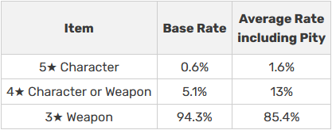

# Gačas sistēmas simulēšana.

## 1. Kas ir gača sistēma?

#### Kā gacha sistēma strādā
* Gača jeb "Gacha" ir veids kā spēlēs var kontrolēt cik ilgā laikā spēlētājs kautko dabūs, piemēram kā, xp, lvl up, items, rare items utt. Ar gaču daudzas spēļu kompanijas arī pelna naudu, lielākai daļai gaču spēlēm, gača strādā lai cilvēks mēģinātu dabūt kādu personāžu spēlē vai uz ļoti retām lietām kuras var dabūt tikai griežot gaču. Cilvēks krājot speciālu valūtu un ar to valūtu ver vaļā , lai dabūtu to reto spēles personāžu vai lietu. Gachai vēl ir tas saucamais "**garants**" ar kuru tu ar 100% iespēju dabūsi reto lietu, tas ir atkarīgs no tā cik daudz kastes esi atvēris vaļā. 

#### Kā izstrādātājs izmanto gacha sistēmu
* Gachu katrs iztrādātājs var pielāgot pa sevam, lai cilvēkam vajaga ļoti daudz laika, lai tiktu līdz garantam un tajā pašā laikā var uztaisīt, lai dabūtu garantu vajadzēs patērēt mazāk laika. Bet daudzās spēlēs lai tiktu līdz garantam vajaga patērēt salīdzinoši daudz laika apmērām pusotrs mēnesis, bet tas ir kā kurā spēlē tas ir salikts.

## 2. Kā mana simulēšana strādās?

#### No kurienes tiks ņemts paraugs
 * Es ņemšu kā piemēru vienu spēli, kur šī gacha sistēma strādā salīdzinoši vienkārši, bet tur ir savas nianses. Pats paraugs tiks paņemts no pašas spēles kur viņi apraksta kā viņu gacha strādā.

#### Kā mana gacha simulēšana strādās
* Sāksim ar to kādi ir rarity veidi:
- 1star 0% (Viss biežāk sastopams)
- 2star 0%
- 3star 94.3% (Krīt ja nenostrādā 4star vai 5star apstrāde)
- 4star 5.1% (10 kastē garantēts)
- 5star 0.6% (90 kastē garantēts) (Viss retākais)
* izmantošu tikai 3, 4 un 5 zvaigzņu rarity, jo tikai šie krīt no kastēm.

* #### Pity noteikšana
Pity, saucamais mīkstais garants, kad kautkādā momentā iespējamība dabūt 4star vai 5star palielinās, bet tā kā tas nav nekur pateikts konkrēti ar kādu griezienu sākas mīkstais garants, tapēc tiks paņemts apmēram vidējais rādītājs.

- 3star (85.4%)
- 4star (13% ar 7 Griezienu)
- 5star (1.6% ar 75 Griezienu)

#### Sīkākas detaļas
- Ja 4star garants sakrīt ar 5star garantu, tad prioritātē izkritīs 5star un nākošaja grizienā 4star.
- katru reizi kad izkrīt 5star, tad automātiski tiek visi griezieni nogriezti uz 0, tad sākas skaitīt par jaunu.
- būs iespēja izvēlēties griezt 1 vai 10 reizes.
- būs dota izvēle starp 2 banneriem, viens banners būs ar noteiktu lietu ko varēs dabūt tikai šajā banneri, bet otrs standarta banners būs tikai ar standarta lietām
- Tiks izmantotas in-game lietas, personāži un lietas.

## 3. Eventa banners
* Eventa banners sevī satur īpašu lietu kā personāžu vai unikalu lietu ar specifisku spēju.
* Eventa bannerī kritīs viss kas krīt no standarta bannera, bet klāt nāks viens 5star, kuru var dabūt tikai eventa banneri.
* kad cilvēkam pirmo reizi izkritīs 5star būs 50/50 iespēja, ka izkritīs tieši eventa lieta, bet kad jau otro reizi izkrīt 5star tad ar 100% iespēju izkritīs eventa lieta.

## 4. Kā cilvēks darbosies ar programmu.

Cilvēks spēs izvēlēties kādu un cik reizes griezt banneri, tad nejauši tiks izvēlēts skaitlis, kas viņam izkritīs un viņš to varēs redzēt(Kāds rarity,kāda lieta, lietas klase.) programma automātiski atmetīs atpakaļ spēlētāju pēc griežanas saglabājot statistiku.